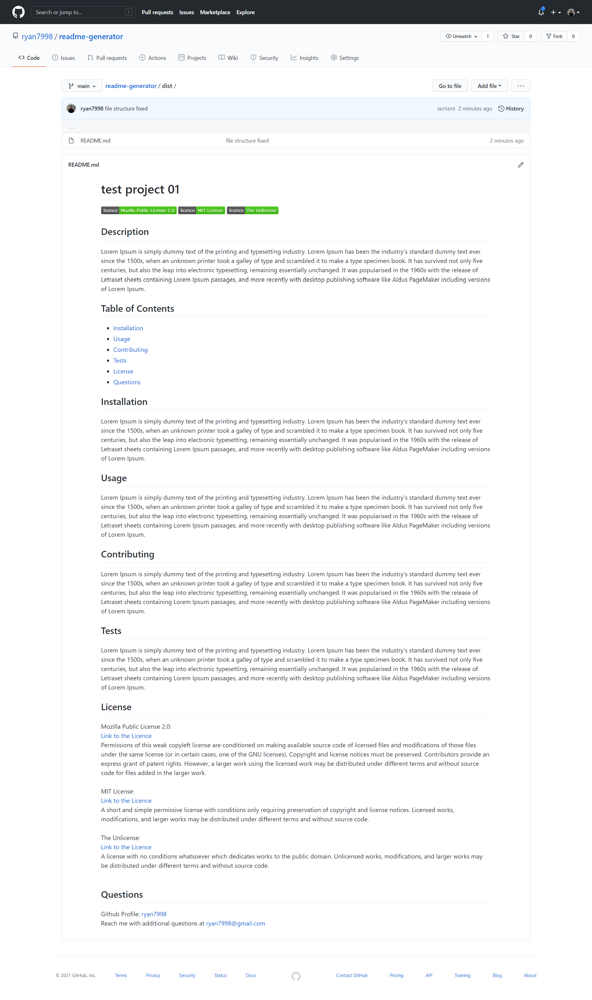

# README Generator
## Screenshot:

## USAGE:

This is a command-line application that accepts user input.

 WHEN user is prompted for information about application repository THEN a high-quality, professional README.md is generated with the title of project and sections entitled Description, Table of Contents, Installation, Usage, License, Contributing, Tests, and Questions.

 WHEN user enters project title THEN this is displayed as the title of the README.

 WHEN user enters a description, installation instructions, usage information, contribution guidelines, and test instructions, THEN this information is added to the sections of the README entitled Description, Installation, Usage, Contributing, and Tests.

 WHEN user choose a license for the application from a list of options THEN a badge for that license is added near the top of the README and a notice is added to the section of the README entitled License that explains which license the application is covered under.

 WHEN user enters GitHub username THEN this is added to the section of the README entitled Questions, with a link to user's GitHub profile

 WHEN user enters email address THEN this is added to the section of the README entitled Questions, with instructions on how to reach with additional questions

 WHEN user click on the links in the Table of Contents THEN he/she is taken to the corresponding section of the README

## DESCRIPTION:

 'dist' forlder contains the README.MD which is created by the application

 'src' contains all the licence in text file which is later linked to the README.MD

 'utils' contains generateMarkdown which creates the markdown of html and also the following:
    -creates licence Badge:
        badge is created dynamically from https://img.shields.io using appropriate parameters and returned as array which is later joined by array.join() function to string to be used in markdown.
    -creates link to the license:
        the link to the license text file as string is returned, which is to be used in markdown.
    - license section is returned which gives a brief summary of the license.

